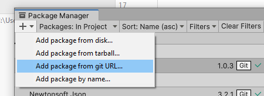

# Aryzon.World Themes

This package allows you to create and upload custom themes for the Aryzon.World application.

## Table of Contents

Details

- [Requirements](#requirements)
- [Installation](#installation)
- [Features](#features)
- [Creating a new Theme](#creating-a-new-theme)
- [Lighting](#lighting)

## Requirements

To be able to use this toolkit there are a few requirements you must adhere to.

### Aryzon.World License

To make themes you need to have an account at Aryzon.World. 
That account must either be a member of an organisation or have a special developer role.

### Unity

Themes are create and uploaded via a Unity Editor tool, so at least working knowledge of Unity is highly recommended.

## Installation

There are two ways to install the Themes SDK.

### Releases Page (Simple)

The easiest way to install the Themes SDK is to simply download the `.unitypackage` file from the releases page here on github.
Then in Unity simply navigate to `Assets > Import Package > Custom Package` and select the package you just downloaded.

### Via Github Link (Advanced)

An alternative way of adding the Themes SDK is adding the package via a git URL.
To do this go to `Window > Package Manager`.
Then add a link to this repository as a package from git here:  

The link you should use is:  
https://github.com/OpenUp-Technologies/Themes-SDK.git?path=/Assets/Themes%20SDK  
This makes sure you get the SDK part of the project

The main advantage to this method is that it is easy to remain up-to-date with changes by simply telling Unity to update the package.

## Creating a new Theme

There are a few steps needed before you can create a custom theme.

### Logging in

To create a new theme you will first need to create a developer profile to log in to Aryzon.World.
To do this navigate to the Custom Themes project settings and press the `Create new profile` button.
Give the profile a nice name and fill in your username and password.
Then click `Create` and choose where to store the profile.
You are now logged in.
You can create multiple profiles for projects where multiple people are working together.

**Note:** The password is only used to do the initial login, it won't be stored on your device.

### Theme Creation

Once you are logged in you can press the `Create new Theme` to create a new theme.
This will bring up a new window where you can configure this theme.

| Name | Description   |
| --- |---------------|
| `Theme Name` | **required:** A human readable name for the theme. |
| `Root Prefab` | **required:** The main map that will be loaded in when a player enters the environment. | 
| `Skybox` | A skybox to replace the skybox from the starting environment. |
| `Set an organisation` | You can choose to upload your theme as belonging to any organisation you are a member of. **This option must be used if you are not a developer.** |
| `Build Targets` | When creating a theme, you can immeditately build it for any targets, choose those targets here. |

### Updating Your Theme

Once you have created your theme you can update existing versions or add new versions.
Worlds are stored using a specific version of a theme.
If you update a version of a theme then the next time you load any world created with it you will get the newly uploaded theme.

This behaviour can be desired, for example if you fixed some lighting that didn't look right.
It can also be undesired, for example if you move some of the scenery around then worlds might suddenly have objects intersecting with the scenery.

If the behaviour is undesired then you should upload a new version of the theme.

Themes use so-called semantic versioning, where the version number is divided in to a major and minor version.
If you make smaller changes you can increment the minor version number.
If make a bigger change, increment the major version number and reset the minor version to 0.

A new theme always starts of with a single `0.1` version, the major version `0` to indicate it's a prototype, not ready for release. 

## Features

### Custom Themes

When creating a world with Aryzon.World, the first step a player makes is choosing a base theme and map.
This theme affects which predefined objects players can add and the starting map.

### Custom Maps

A theme's starting map consists of an immutable base environment and a collection of starting objects.
The starting map is a prefab that you assign to the `Root Object` field of your theme.

You can then mark objects in the starting map with a special `ConvertToSolution` component that makes them playable objects once the map has been loaded.
It does this by referencing a specific prefab that should be loaded in as the playable object.
See the [full article](Documentation/Articles/ConvertToSolution.md) for details. 

### Custom Objects

You can also define themed objects that are available under the Theme tab in add objects.
This is simply a list of prefabs in the theme asset.

## Lighting

By default, Unity does not support baked lighting on prefabs, only on the scene.
To allow custom maps to support baked lighting, we have a BakePrefabLighting utility.

To use this utility add the script `Bake Prefab Lighting` to the root object of your map.
Then add this root prefab to a new scene and set up the lighting so that it looks good.
Once you've done that select `Assets > Bake Prefab Lightmaps`. 
The Unity Editor will run its lightmap baking routine, then store the baked lightmaps using the `BakePrefabLighting` script.
